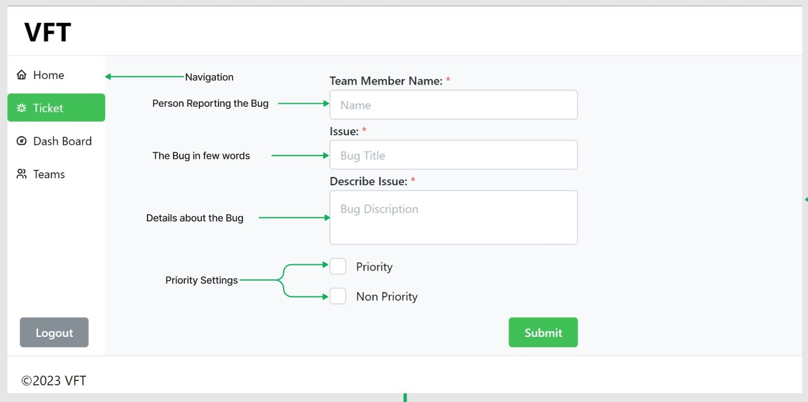
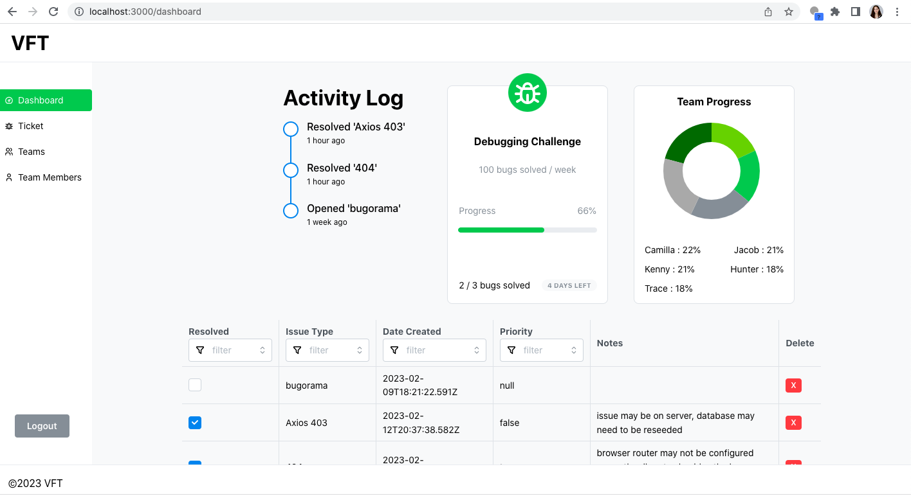
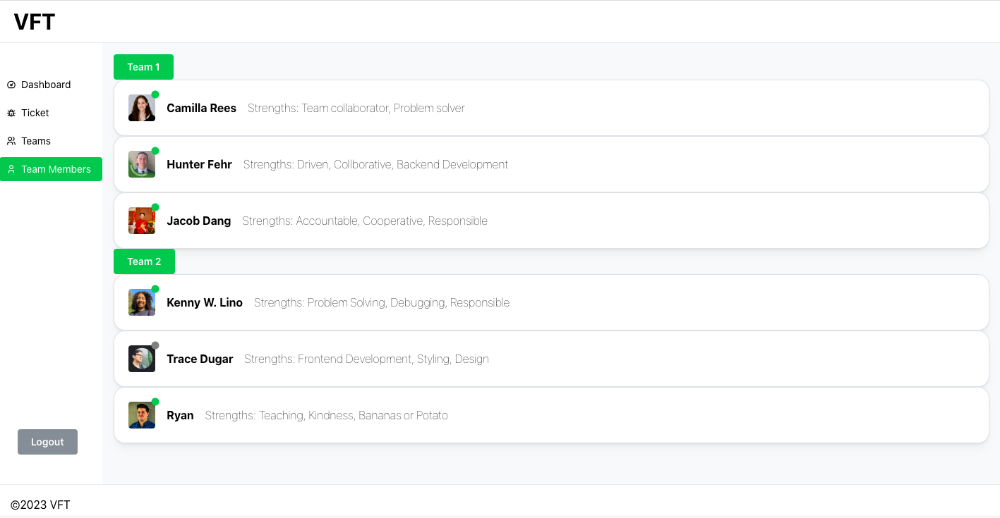
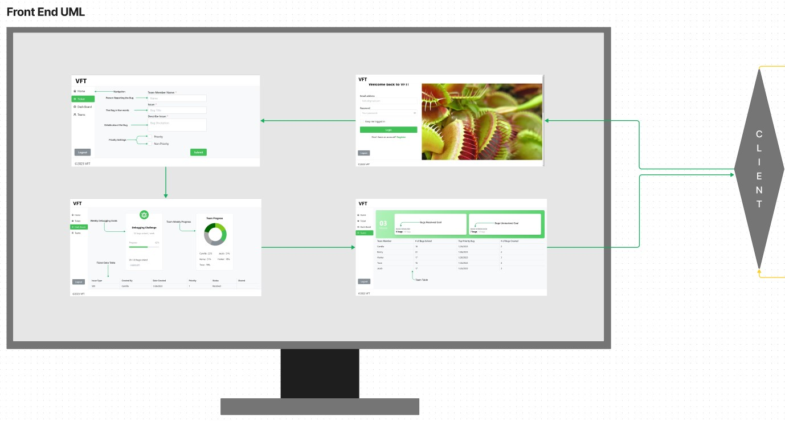
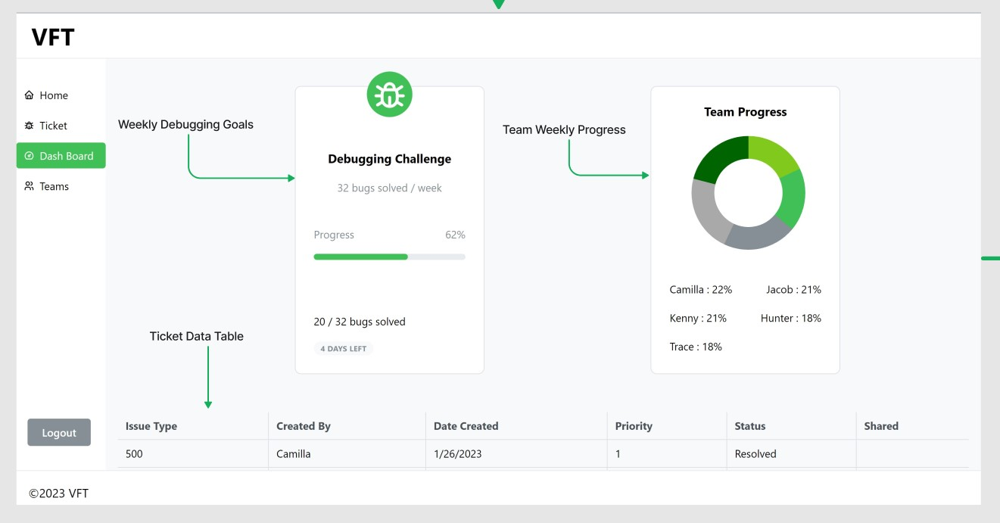
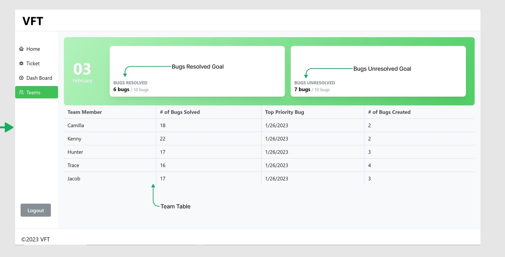

# VFT Bug Tracker

## Team: Camilla Rees, Hunter Fehr, Kenny Lino, Jacob Dang, Trace Dugar

## Description

Bug tracker designed to help development teams document current bugs and their solutions to communicate effectively and prevent technical debt down the line.

## Links and Resources

 - [Front End Github Repository](https://github.com/chjkt-bug-tracker/bug-tracker-frontend)
 - [Netlify](https://vft.netlify.app/)
 - [Back End Github Repository](https://github.com/chjkt-bug-tracker/bug-tracker-backend)
 - [SQL Database](https://dashboard.render.com/d/dpg-cfc5ec9gp3jokp7k2kng-a)

### Running the application

- `npm start`

### Features and Routes
- Feature 1: Hero page

- Feature 2: Login handled by bearer auth.

- Feature 3: App Shell helps with organization of components.
- Feature 4: Navigation bar with highlight keeps the user aware of location within App.
- Feature 5: Ticket input form, allows for users to input tickets.
    - Subfeature 1: Priority setting within ticket allows for urgent bugs to be placed at the top of the list.

- Feature 6: Dashboard allows for easy access to a collection of information.
    - Subfeature 1: Activity log allows dev to keep track of their most recent activity on their account
    - Subfeature 2: Debugging challenge component allows for the tracking of debugging goals and the progress being made.
    - Subfeature 3: Team Progress component allows for the visualization of progress being made by the team.
    - Subfeature 4: Ticket Data Table givves a breakdown of the tickets and their status within the dashboard.

- Feature 7: Teams Page allows for the tracking of Team data.
    - Subfeature 1: Daily goals listed at the top to show how those metrics are being met.
    - Subfeature 2: Teams Table neatly organizes the finer detailed data for the entire team.
- Feature 8: Team Members page allows devs to see which of their team members are active

#### UML / Diagrams

